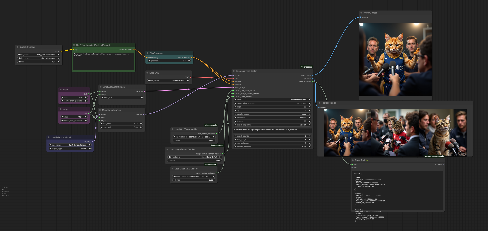

# ComfyUI-InferenceTimeScaling

A ComfyUI extension implementing "Inference-time scaling for diffusion models beyond scaling denoising steps" ([Ma et al., 2025](https://arxiv.org/abs/2501.09732)). This extension provides inference-time optimization techniques to enhance diffusion-based image generation quality through random search and zero-order optimization algorithms, along with an ensemble verification system.


*Prompt: "Photo of an athlete cat explaining it's latest scandal at a press conference to journalists."*

## Features

- Implementation of two search algorithms from the paper:
  - Random search optimization
  - Zero-order optimization
- Ensemble verification system using three verifiers:
  - CLIP Score verification
  - ImageReward verification
  - VLM grading using Qwen2.5-VL-7B
- Automated model downloading and management



[View example workflows](workflows/)

## Installation

### Prerequisites

1. Install [ComfyUI](https://github.com/comfyanonymous/ComfyUI)
2. Install [ComfyUI-Manager](https://github.com/ltdrdata/ComfyUI-Manager)

### Hardware Requirements

This was developed and tested on a system with:
- Single NVIDIA L40S GPU (48GB VRAM)
- 62GB System RAM

### Installation Methods

#### Using ComfyUI-Manager (Recommended)
1. Open ComfyUI
2. Open the Manager panel
3. Search for "InferenceScale"
4. Click "Install"
5. Restart ComfyUI

#### Manual Installation
```bash
cd ComfyUI/custom_nodes
git clone https://github.com/MaximClouser/ComfyUI-InferenceTimeScaling
cd ComfyUI-InferenceScale
pip install -e .
```

## Usage

The extension adds the following nodes to ComfyUI:

### InferenceTimeScaler Node

This is the main node implementing the random search and zero-order optimization algorithms from the paper.

#### Inputs:
- `model`: (MODEL) Denoising model
- `seed`: (INT) Random seed for reproducibility
- `steps`: (INT) Number of denoising steps
- `cfg`: (FLOAT) Classifier-Free Guidance scale
- `sampler_name`: (SAMPLER) Sampling algorithm
- `scheduler`: (SCHEDULER) Noise scheduler
- `positive`: (CONDITIONING) Positive prompt conditioning
- `negative`: (CONDITIONING) Negative prompt conditioning
- `latent_image`: (LATENT) Input latent image
- `denoise`: (FLOAT) Amount of denoising to apply
- `text_prompt_to_compare`: (STRING) Text prompt for verifiers
- `search_rounds`: (INT) Number of search rounds (random seeds for random search, or iterations for zero-order search)
- `vae`: (VAE) VAE model for decoding latents
- `view_top_k`: (INT) Number of top images to show in grid
- `search_algorithm`: Choice between "random" and "zero-order"
- `num_neighbors`: (INT) Number of neighbors per iteration in zero-order search (only used if search_algorithm is "zero-order")
- `lambda_threshold`: (FLOAT) Perturbation step size for zero-order search (only used if search_algorithm is "zero-order")

#### Optional Inputs:
- `loaded_clip_score_verifier`: (CS_VERIFIER) CLIP model for scoring
- `loaded_image_reward_verifier`: (IR_VERIFIER) ImageReward model
- `loaded_qwen_verifier`: (QWN_VERIFIER) Qwen VLM model

**Note:** At least one verifier must be included!

#### Outputs:
- `Best Image`: The highest-scoring generated image
- `Top-k Grid`: Grid view of the top-k scoring images
- `Top-k Score(s)`: JSON string containing detailed scores

### LoadQwenVLMVerifier Node

Loads the Qwen VLM verifier model for image evaluation.

#### Inputs:
- `qwen_verifier_id`: Model identifier (default: "Qwen/Qwen2.5-VL-7B-Instruct")
- `device`: Device to load model on ("cuda" or "cpu")

#### Outputs:
- `qwen_verifier_instance`: Loaded Qwen verifier instance

### LoadCLIPScoreVerifier Node

Loads the CLIP model for computing text-image similarity scores.

#### Inputs:
- `clip_verifier_id`: Model identifier (default: "openai/clip-vit-base-patch32")
- `device`: Device to load model on ("cuda" or "cpu")

#### Outputs:
- `clip_verifier_instance`: Loaded CLIP verifier instance

### LoadImageRewardVerifier Node

Loads the ImageReward model for image quality assessment.

#### Inputs:
- `ir_verifier_id`: Model identifier (default: "ImageReward-v1.0")
- `device`: Device to load model on ("cuda" or "cpu")

#### Outputs:
- `image_reward_verifier_instance`: Loaded ImageReward verifier instance

## Example Workflow

1. Load your model using the standard ComfyUI checkpoint loader
2. Load the verifier models using their respective loader nodes
3. Connect everything to the InferenceTimeScaler node
4. Set your desired search algorithm and parameters
5. Generate optimized images with improved quality

## Current Limitations

- Single latent processing only (batch size = 1) - performance limitation
- Sequential verification (one image-text pair at a time) - speed bottleneck

## Future Work

- [ ] Add batch processing support for image generation (performance optimization)
- [ ] Implement batched verification for multiple image-text pairs (speed optimization)
- [ ] Enable configurable scoring criteria for Qwen VLM verifier (currently only uses overall score)
  - Allow users to select specific aspects like visual quality, creativity, etc.
  - Support weighted combinations of multiple scoring criteria

## Development

To install development dependencies:

```bash
cd inferencescale
pip install -e .[dev]
pre-commit install
```

## License

[MIT License](LICENSE)

## Acknowledgments

- Thanks to the authors of the original paper for their research
- ComfyUI team for the excellent framework
- [tt-scale-flux](https://github.com/sayakpaul/tt-scale-flux) repository for the `generate_neighbors` function
- Qwen team for their powerful VLM model
