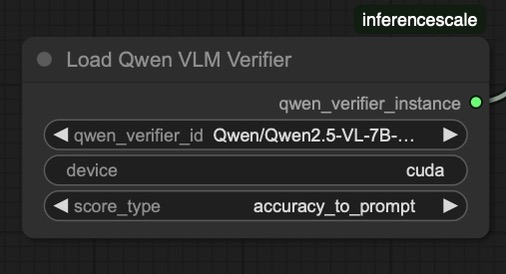

# ComfyUI-InferenceTimeScaling


A ComfyUI extension implementing "Inference-time scaling for diffusion models beyond scaling denoising steps" ([Ma et al., 2025](https://arxiv.org/abs/2501.09732)). This extension provides inference-time optimization techniques to enhance diffusion-based image generation quality through random search and zero-order optimization algorithms, along with an ensemble verification system.


*Prompt: "Photo of an athlete cat explaining it's latest scandal at a press conference to journalists."*

## Features

- Implementation of two search algorithms from the paper:
  - Random search optimization
  - Zero-order optimization
- Ensemble verification system using three verifiers:
  - CLIP Score verification
  - ImageReward verification
  - VLM grading using Qwen2.5-VL-7B
- Automated model downloading and management


*Simple example using FLUX-1 Dev with random search for 6 rounds*

[View example workflows](workflows/)

## How It Works

This extension implements two different search algorithms to find the best possible image for your prompt:

1. **Random Search**: The simplest approach - generates multiple images with different random noises and evaluates them to explore the noise space.

2. **Zero-Order Search**: A more sophisticated approach that performs local optimization. It starts with a random noise, generates nearby variations by perturbing noise, and iteratively moves toward better results based on evaluation.

To explore the noise space, the quality of generated images is evaluated using an ensemble of three verifiers:

- **CLIP Score**: Measures how well the image matches the text prompt using OpenAI's CLIP model
- **ImageReward**: Evaluates image quality and prompt alignment using a specialized reward model
- **Qwen VLM**: Uses a large vision-language model to provide detailed scoring across multiple aspects (visual quality, creativity, prompt accuracy, etc.)

By exploring the noise space and using these verifiers to guide the search, it can produce images of higher quality and better prompt alignment than simply increasing denoising steps, with the tradeoff being increased time and compute during inference.

For more detailed information about the algorithms and methodology, please refer to the original paper from Google DeepMind: ["Inference-time scaling for diffusion models beyond scaling denoising steps"](https://arxiv.org/abs/2501.09732).

## Installation

### Prerequisites

1. Install [ComfyUI](https://github.com/comfyanonymous/ComfyUI)
2. Install [ComfyUI-Manager](https://github.com/ltdrdata/ComfyUI-Manager)

### Hardware Requirements

This was developed and tested on a system with:
- Single NVIDIA L40S GPU (48GB VRAM)
- 62GB System RAM

### Installation Methods

#### Using ComfyUI-Manager (Recommended)
1. Open ComfyUI
2. Open the Manager panel
3. Search for "ComfyUI-InferenceTimeScaling"
4. Click "Install"
5. Restart ComfyUI

#### Manual Installation
```bash
cd ComfyUI/custom_nodes
git clone https://github.com/YRIKKA/ComfyUI-InferenceTimeScaling
cd ComfyUI-InferenceTimeScaling
pip install -e .
```

## Usage

The extension adds the following nodes to ComfyUI:

### InferenceTimeScaler Node

This is the main node implementing the random search and zero-order optimization algorithms from the paper.


#### Inputs:
- `model`: (MODEL) Denoising model
- `seed`: (INT) Random seed for reproducibility
- `steps`: (INT) Number of denoising steps
- `cfg`: (FLOAT) Classifier-Free Guidance scale
- `sampler_name`: (SAMPLER) Sampling algorithm
- `scheduler`: (SCHEDULER) Noise scheduler
- `positive`: (CONDITIONING) Positive prompt conditioning
- `negative`: (CONDITIONING) Negative prompt conditioning
- `latent_image`: (LATENT) Input latent image
- `denoise`: (FLOAT) Amount of denoising to apply
- `text_prompt_to_compare`: (STRING) Text prompt for verifiers
- `search_rounds`: (INT) Number of search rounds (random seeds for random search, or iterations for zero-order search)
- `vae`: (VAE) VAE model for decoding latents
- `view_top_k`: (INT) Number of top images to show in grid
- `search_algorithm`: Choice between "random" and "zero-order"

> [!IMPORTANT]
> The following parameters are **only used for zero-order search** and have no effect when using random search:
> - `num_neighbors`: (INT) Number of neighbors per iteration in zero-order search
> - `lambda_threshold`: (FLOAT) Perturbation step size for zero-order search

#### Optional Inputs:
- `loaded_clip_score_verifier`: (CS_VERIFIER) CLIP model for scoring
- `loaded_image_reward_verifier`: (IR_VERIFIER) ImageReward model
- `loaded_qwen_verifier`: (QWN_VERIFIER) Qwen VLM model

> [!NOTE]
> The verifiers are optional - you can choose which ones to use by connecting them to the node. However, at least one verifier must be connected for the node to function!

#### Outputs:
- `Best Image`: The highest-scoring generated image
- `Top-k Grid`: Grid view of the top-k scoring images
- `Top-k Score(s)`: JSON string containing detailed scores

### LoadQwenVLMVerifier Node

Loads the Qwen VLM verifier model for image evaluation.



#### Inputs:
- `qwen_verifier_id`: Model identifier (default: "Qwen/Qwen2.5-VL-7B-Instruct")
- `device`: Device to load model on ("cuda" or "cpu")
- `score_type`: Type of score to return from the evaluation (default: "overall_score"). Options:
  - `overall_score`: Weighted average of all aspects
  - `accuracy_to_prompt`: How well the image matches the text description
  - `creativity_and_originality`: Uniqueness and creative interpretation
  - `visual_quality_and_realism`: Overall visual quality, detail, and realism
  - `consistency_and_cohesion`: Internal consistency and natural composition
  - `emotional_or_thematic_resonance`: How well the image captures the intended mood/theme

#### Outputs:
- `qwen_verifier_instance`: Loaded Qwen verifier instance

The model will be downloaded automatically on first use (you do not need to have these weights locally beforehand).

### LoadCLIPScoreVerifier Node

Loads the CLIP model for computing text-image similarity scores.


#### Inputs:
- `clip_verifier_id`: Model identifier (default: "openai/clip-vit-base-patch32")
- `device`: Device to load model on ("cuda" or "cpu")

#### Outputs:
- `clip_verifier_instance`: Loaded CLIP verifier instance

The model will be downloaded automatically on first use (you do not need to have these weights locally beforehand).

### LoadImageRewardVerifier Node

Loads the ImageReward model for image quality assessment.


#### Inputs:
- `ir_verifier_id`: Model identifier (default: "ImageReward-v1.0")
- `device`: Device to load model on ("cuda" or "cpu")

#### Outputs:
- `image_reward_verifier_instance`: Loaded ImageReward verifier instance

The model will be downloaded automatically on first use (you do not need to have these weights locally beforehand).

## Example Workflow

1. Load your model using the standard ComfyUI checkpoint loader
2. Load the verifier models using their respective loader nodes
3. Connect everything to the InferenceTimeScaler node
4. Set your desired search algorithm and parameters
5. Generate optimized images with improved quality

## Current Limitations

- Single latent processing only (batch size = 1) - performance limitation
- Sequential verification (one image-text pair at a time) - speed bottleneck

## Future Work

- [x] Enable configurable scoring criteria for Qwen VLM verifier
  - Allow users to select specific aspects like visual quality, creativity, etc.
  - Support individual aspect scoring
- [ ] Add batch processing support for image generation (performance optimization)
- [ ] Implement batched verification for multiple image-text pairs (speed optimization)
- [ ] Add support for image-to-image and image+text conditioning to image models (currently only supports text-to-image models)


## License

[MIT License](LICENSE)

## Acknowledgments

- Thanks to the authors of the original paper for their research
- ComfyUI team for the excellent framework
- [tt-scale-flux](https://github.com/sayakpaul/tt-scale-flux) repository for the `generate_neighbors` function
- Qwen team for their powerful VLM model
